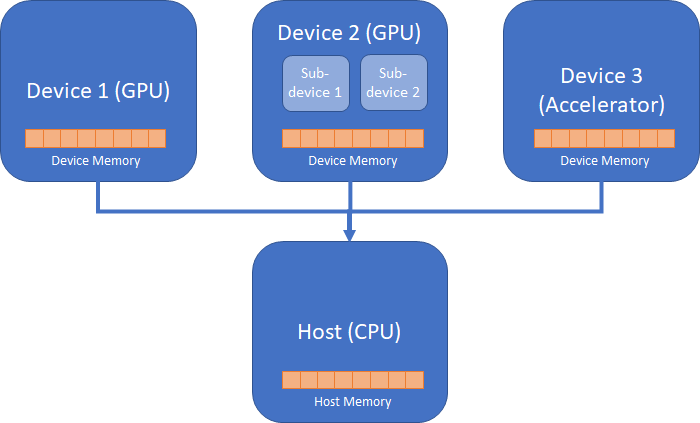
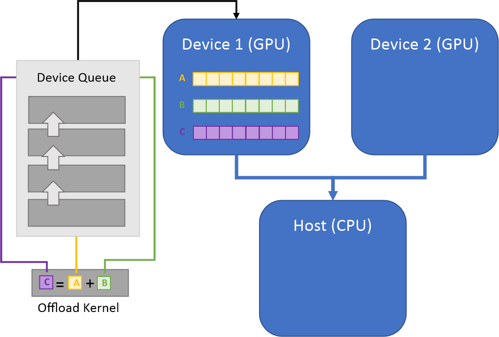
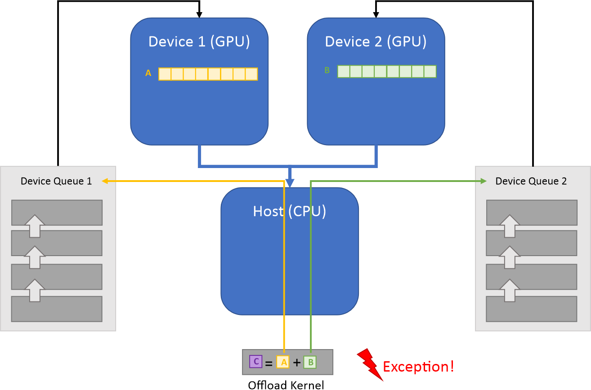
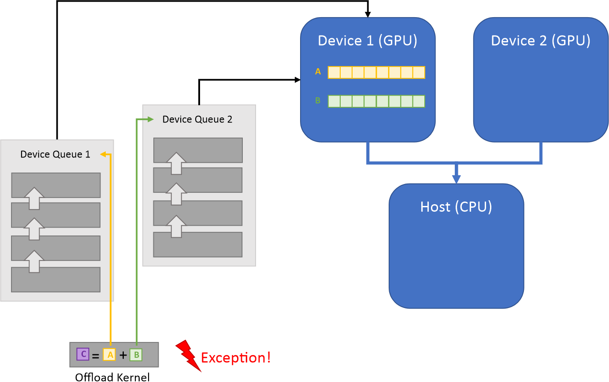
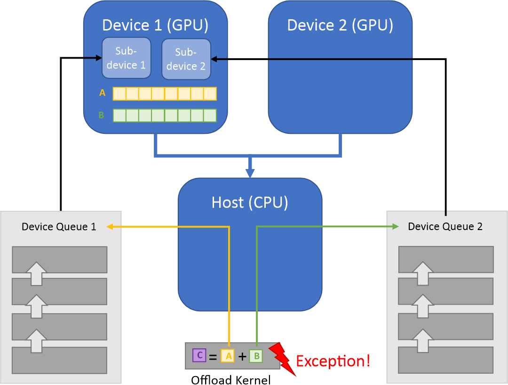

.. _heterogeneous_computing:
.. include:: ./ext_links.txt

Heterogeneous Computing
=======================

Device Offload
**************

Python is an interpreted language. It means that most Python codes run on CPU,
and only a few data parallel regions execute on data parallel devices.
That is why the concept of the host and offload devices is helpful in conceptualizing
a heterogeneous programming model in Python.

The diagram above illustrates the *host* (the CPU that runs the Python interpreter) and three *devices*
(two GPU devices and one attached accelerator device). **Data Parallel Extensions for Python**
offer a programming model where a script executed by Python interpreter on the host can *offload* data-parallel 
kernels to a user-specified device. A *kernel* is the *data-parallel region* of a program submitted
for execution on the device. There can be multiple data-parallel regions, hence multiple *offload kernels*.

Kernels can be pre-compiled into a library, such as ``dpnp``, or directly coded
in a programming language for heterogeneous computing, such as `OpenCl*`_ or `DPC++`_ .
**Data Parallel Extensions for Python** offer the way of writing kernels directly in Python
using `Numba*`_ compiler along with ``numba-dpex``, the `Data Parallel Extension for Numba*`_.

One or more kernels are submitted for execution into a *queue* targeting an *offload device*.
For each device, you can create one or more queues. In most cases, you do not need to work
with device queues directly. Data Parallel Extensions for Python do necessary underlying
work with queues for you through the :ref:`Compute-Follows-Data`.

Unified Shared Memory
*********************

Each device has its memory, not necessarily accessible from another device.

For example, **Device 1** memory may not be directly accessible from the host but accessible
via expensive copying by driver software. Similarly, depending on the architecture, direct data
exchange between **Device 2** and **Device 1** may be only possible via expensive
copying through the host memory. These aspects must be taken into consideration when programming
parallel data devices.

On the illustration above, the **Device 2** logically consists of two sub-devices: **Sub-Device 1**
and **Sub-Device 2**. The programming model allows accessing **Device 2**:

* As a single logical device. To do so, create a queue for **Device 2**.
* By working with each individual sub-devices. To do so, create two queues, one for each sub-device.

`SYCL*`_ standard introduces the *Unified Shared Memory* (USM) concept. USM requires hardware support
for unified virtual address space, which allows coherency between the host and the device
pointers. The host allocates all memory, but offers three distinct allocation types:

* **Host: located on the host, accessible by the host or device.** This type of memory is useful in a situation
  when you need to stream read-only data from the host to the device once.

* **Device: located on the device, accessible only by the device.** The fastest type of memory.
  Useful in a situation when most of the data crunching happens on the device.

* **Shared: location is both host and device (underlying software synchronizes copies), accessible by
  the host or device.** Shared allocations are useful when both host and devices access data
  since you do not need to manage data migration explicitly. However, it is much slower than the USM Device memory type.

Compute-Follows-Data
********************
Since data copying between devices is typically very expensive, for performance reasons it is essential
to process data close to where it is allocated. This is the premise of the *Compute-Follows-Data* programming model,
which states that the compute happens where the data resides. Tensors implemented in ``dpctl`` and ``dpnp``
carry information about allocation queues, hence about the device on which an array is allocated.
Based on tensor input arguments of the offload kernel, it deduces the queue on which the execution happens.

The picture above illustrates the *Compute-Follows-Data* concept. Arrays ``A`` and ``B`` are inputs to the
**Offload Kernel**. These arrays carry information about their *allocation queue* (**Device Queue**) and the
*device* (**Device 1**) where they are created. According to the Compute-Follows-Data paradigm,
the **Offload Kernel** is submitted to this **Device Queue**, and the resulting array ``C`` is created on the **Device Queue** associated with the **Device 1**.

**Data Parallel Extensions for Python** require all input tensor arguments to have the **same** allocation queue.
Otherwise, an exception is thrown. For example, the following usages result in an exception.

    Input tensors are on different devices and different queues. Exception is thrown.

    Input tensors are on the same device, but queues are different. Exception is thrown.

    Data belongs to the same device, but queues are different and associated with different sub-devices.

Copying Data Between Devices and Queues
***************************************

**Data Parallel Extensions for Python** create **one** *canonical queue* per device. Normally, 
you do not need to directly manage queues. Having one canonical queue per device
allows you to copy data between devices using the ``to_device()`` method:

.. code-block:: python

   a_new = a.to_device(b.device)

Array ``a`` is copied to the device associated with array ``b`` into the new array ``a_new``.
The same queue is associated with ``b`` and ``a_new``.

Alternatively, you can do this as follows:

.. code-block:: python
    :caption: DPNP array

    a_new = dpnp.asarray(a, device=b.device)

.. code-block:: python
    :caption: DPCtl array

    a_new = dpctl.tensor.asarray(a, device=b.device)

Creating Additional Queues
**************************

As said before, **Data Parallel Extensions for Python** automatically create one canonical queue per device,
and you normally work with this queue implicitly. However, you can always create as many additional queues per device
as needed and work explicitly with them. For example, for profiling purposes.

Read `Data Parallel Control`_ documentation for more details about queues.

