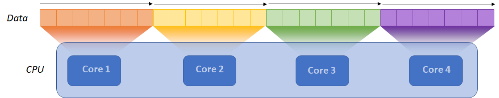
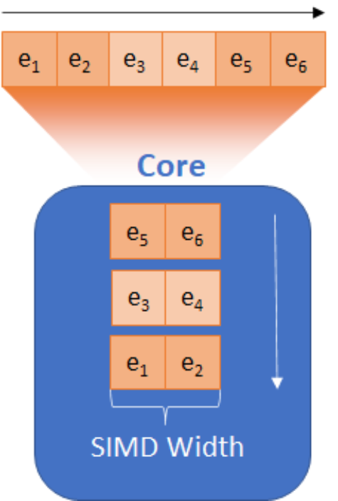

.. _parallelism:
.. include:: ./ext_links.txt

Parallelism in Modern Data Parallel-Architectures
=================================================

Python is loved for its productivity and interactivity. But when it comes to dealing with
computationally heavy codes, Python performance cannot be compromised. Intel(R) and Python numerical
computing communities, such as `NumFOCUS <https://numfocus.org/>`_, dedicate attention to
optimizing core numerical and data science packages for leveraging parallelism available in modern CPUs:

* **Multiple computational cores:** Several computational cores allow to process the data concurrently.
  Compared to a single-core CPU, *N* cores can process either *N* times bigger data in a fixed time, or
  reduce a computation time *N* times for a set amount of data.

* **SIMD parallelism:** SIMD (Single Instruction Multiple Data) is a special type of instructions
  that perform operations on vectors of data elements at the same time. The size of vectors is called the SIMD width.
  If a SIMD width is *K*, then a SIMD instruction can process *K* data elements in parallel.

  In the following diagram, the SIMD width is 2, which means that a single instruction processes two elements simultaneously.
  Compared to regular instructions that process one element at a time, 2-wide SIMD instruction performs
  two times more data in the set time, or, respectively, process a fixed amount of data two times faster.

* **Instruction-Level Parallelism:** Modern CISC architectures, such as x86, allow performing data-independent
  instructions in parallel. In the following example, see how to compute :math:`a * b + (c - d)`.
  Operations :math:`*` and :math:`-` can be executed in parallel, the last instruction
  :math:`+` depends on availability of :math:`a * b` and :math:`c - d` and cannot be executed in parallel
  with :math:`*` and :math:`-`.

