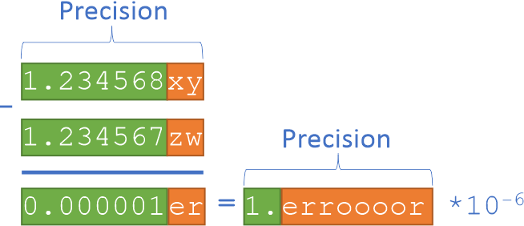

.. _programming_dpep:
.. include:: ./ext_links.txt

Programming with Data Parallel Extensions for Python
====================================================

As we briefly outlined, **Data Parallel Extensions for Python** consist of three foundational packages:

* the `Numpy*`_-like library, ``dpnp``;
* the compiler extension for `Numba*`_, ``numba-dpex``
* the library for managing devices, queues, and heterogeneous data, ``dpctl``.

Their underlying implementation is based on `SYCL*`_ standard, which is a cross-platform abstraction layer
for heterogeneous computing on data parallel devices, such as CPU, GPU, or domain specific accelerators.

Scalars vs. 0-dimensional arrays
********************************

Primitive types such as Python’s and Numpy’s ``float``, ``int``, or ``complex``, used to represent scalars,
have the host storage. In contrast, ``dpctl.tensor.usm_ndarray`` and ``dpnp.ndarray`` have USM storage
and carry associated allocation queue. For the :ref:`Compute-Follows-Data` consistent behavior
all ``dpnp`` operations that produce scalars will instead produce respective 0-dimensional arrays.

That implies, that some code changes may be needed to replace scalar math operations with respective
``dpnp`` array operations. See `Data Parallel Extension for Numpy*`_ - **API Reference** section for details.

Data Parallel Extension for Numpy - dpnp
****************************************

The ``dpnp`` library is a bare minimum to start programming numerical codes for data parallel devices.
You may already have a Python script written in `Numpy*`_. Being a drop-in replacement of (a subset of) `Numpy*`_,
to execute your `Numpy*`_ script on GPU usually requires changing just a few lines of the code:

.. literalinclude:: ../../examples/01-hello_dpnp.py
   :language: python
   :lines: 27-
   :caption: **EXAMPLE 01:** Your first NumPy code running on GPU
   :name: ex_01_hello_dpnp

In this example ``np.asarray()`` creates an array on the default `SYCL*`_ device, which is ``"gpu"`` on systems
with integrated or discrete GPU (it is ``"host"`` on systems that do not have GPU).
The queue associated with this array is now carried with ``x``, and ``np.sum(x)`` will derive it from ``x``,
and respective pre-compiled kernel implementing ``np.sum()`` will be submitted to that queue.
The result ``y`` will be allocated on the device 0-dimensional array associated with that queue too.

All ``dpnp`` array creation routines as well as random number generators have additional optional keyword arguments
``device``, ``queue``, and ``usm_type``, using which you can explicitly specify on which device or queue you want
the tensor data to be created along with USM memory type to be used (``"host"``, ``"device"``, or ``"shared"``).
In the following example we create the array ``x`` on the GPU device, and perform a reduction sum on it:

.. literalinclude:: ../../examples/02-dpnp_device.py
   :language: python
   :lines: 27-
   :caption: **EXAMPLE 02:** Select device type while creating array
   :name: ex_02_dpnp_device

Data Parallel Extension for Numba - numba-dpex
**********************************************

`Numba*`_ is a powerful Just-In-Time (JIT) compiler that works best on `Numpy*`_ arrays, `Numpy*`_ functions, and loops.
Data parallel loops is where the data parallelism resides. It allows leveraging all available CPU cores,
SIMD instructions, and schedules those in a way that exploits maximum instruction-level parallelism.
The ``numba-dpex`` extension allows to compile and offload data parallel regions to any data parallel device.
It takes just a few lines to modify your CPU `Numba*`_ script to run on GPU.

.. literalinclude:: ../../examples/03-dpnp2numba-dpex.py
   :language: python
   :lines: 27-
   :caption: **EXAMPLE 03:** Compile dpnp code with numba-dpex
   :name: ex_03_dpnp2numba_dpex

In this example we implement a custom function ``sum_it()`` that takes an array input. We compile it with
`Data Parallel Extension for Numba*`_. Being just-in-time compiler, Numba derives the queue from input argument ``x``,
which is associated with the default device (``"gpu"`` on systems with integrated or discrete GPU) and
dynamically compiles the kernel submitted to that queue. The result will reside as a 0-dimensional array on the device
associated with the queue, and on exit from the offload kernel it will be assigned to the tensor y.

The ``parallel=True`` setting in ``@njit` is essential to enable generation of data parallel kernels.
Please also note that we use ``fastmath=True`` in ``@njit`` decorator. This is an important setting
to instruct the compiler that you’re okay NOT preserving the order of floating-point operations.
This will enable generation of instructions (such as SIMD) for greater performance.

Data Parallel Control - dpctl
*****************************

Both ``dpnp`` and ``numba-dpex`` provide enough API versatility for programming data parallel devices but
there are some situations when you will need to use dpctl advanced capabilities:

1. **Advanced device management.** Both ``dpnp`` and ``numba-dpex`` support Numpy array creation routines
   with additional parameters that specify the device on which the data is allocated and the type of memory to be used
   (``"device"``, ``"host"``, or ``"shared"``). However, if you need some more advanced device and data management
   capabilities you will also need to import ``dpctl`` in addition to ``dpnp`` and/or ``numba-dpex``.

   One of frequent usages of ``dpctl`` is to query the list devices present on the system, available driver backend
   (such as ``"opencl"``, ``"level_zero"``, ``"cuda"``, etc.)

   Another frequent usage is the creation additional queues for the purpose of profiling or choosing an out-of-order
   execution of offload kernels.

.. literalinclude:: ../../examples/04-dpctl_device_query.py
   :language: python
   :lines: 27-
   :caption: **EXAMPLE 04:** Get information about devices
   :name: ex_04_dpctl_device_query

2. **Cross-platform development using Python Array API standard.** If you’re a Python developer
   programming Numpy-like codes and targeting different hardware vendors and different tensor implementations,
   then going with `Python* Array API Standard`_ is a good choice for writing a portable Numpy-like code.
   The ``dpctl.tensor`` implements `Python* Array API Standard`_ for `SYCL*`_ devices. Accompanied with
   respective SYCL device drivers from different vendors ``dpctl.tensor`` becomes a portable solution
   for writing numerical codes for any SYCL device.

   For example, some Python communities, such as
   `Scikit-Learn* community <https://github.com/scikit-learn/scikit-learn/issues/22352>`_, are already establishing
   a path for having algorithms (re-)implemented using `Python* Array API Standard`_ .
   This is a reliable path for extending their capabilities beyond CPU only, or beyond certain GPU vendor only.

3. **Zero-copy data exchange between tensor implementations.** Certain Python projects may have own tensor
   implementations not relying on ``dpctl.tensor`` or ``dpnp.ndarray`` tensors. Can users still exchange data
   between these tensors not copying it back and forth through the host?
   `Python* Array API Standard`_ specifies the data exchange protocol for zero-copy exchange
   between tensors through ``dlpack``. Being the `Python* Array API Standard`_ implementation
   ``dpctl`` provides ``dpctl.tensor.from_dlpack()`` function used for zero-copy view of another tensor input.

Debugging and profiling Data Parallel Extensions for Python
***********************************************************
`Intel oneAPI Base Toolkit`_ provides two tools to assist programmers to analyze performance issues in programs
that use **Data Parallel Extensions for Python**. They are `Intel VTune Profiler`_ and
`Intel Advisor`_.

Intel VTune Profiler examines various performance aspects of a program like, the most time-consuming parts,
efficiency of offloaded code, impact of memory sub-systems, etc.

Intel Advisor provides insights on the performance of offloaded code relative to the peak performance and
memory bandwidth.

Next, we will detail the steps involved in using Intel VTune Profiler and Intel Advisor with
heterogenous programs that use **Data Parallel Extensions for Python**.

Profiling with Intel VTune Profiler
-----------------------------------

.. |copy| unicode:: U+000A9

.. |trade| unicode:: U+2122

Intel |copy| VTune |trade| Profiler provides two mechanisms, called *GPU offload* and *GPU hotspots*, to profile heterogeneous programs
targeted to GPUs.

The *GPU offload* analysis profiles the entire application (both GPU and host code) and helps to identify
if the application is CPU or GPU bound. It provides information on the proportion of the execution time spent
in GPU execution. It also provides information about various hotspots in the program. The key goal of the *GPU offload*
analysis is to identify the parts of the program that can benefit from offloading to GPUs.

The *GPU hotspots* analysis focuses on providing insights into the performance of GPU-offloaded code.
It provides insights about the parallelism in the GPU kernel, the efficiency of the kernel, SIMD utilization
and memory latency. It also provides performance data regarding synchronization operations like GPU barriers and
atomic operations.

The following instructions are used execute the two Intel VTune Profiler analyses on programs written
using **Data Parallel Extensions for Python**.

.. code-block:: console
    :caption: **GPU Offload**

    > vtune -collect gpu-offload -r <output_dir> -- python <script>.py <args>

.. code-block:: console
    :caption: **GPU Hotspots**

    > vtune -collect gpu-hotspots -r <output_dir> -- python <script>.py <args>

Intel VTune Profiler performs dynamic binary analysis on a given program to obtain insights on various
performance characteristics. It can run on unmodified binaries with no extra requirements for program compilation.
After collecting the data using the above commands, the Intel VTune Profiler GUI can be used to view various
performance characteristics. In addition to the GUI, it provides mechanisms to generate reports through
the command line and setup a web server for post processing the data.

Further details on viewing Intel VTune Profiler output along with other use-cases can be found in the
`Intel VTune Profiler User Guide <https://www.intel.com/content/www/us/en/develop/documentation/vtune-help/top.html>`_.

Profiling with Intel Advisor
----------------------------

The primary goal of Intel |copy| Advisor is to help programmers make targeted optimizations by identifying
appropriate kernels and characterizing the performance limiting factors. Intel Advisor provides mechanisms
to analyze the performance of GPU kernels against the hardware roof-line performance. It provides information
about the maximum achievable performance with the given hardware conditions and helps identify the best
kernels for optimization. Further, it helps the programmer characterize if a GPU kernel is bound by
compute capacity or by memory bandwidth.

The following instructions are used to generate GPU roof-line performance graphs using Intel Advisor.

.. code-block:: console
    :caption: **Collect Roofline**

    > advisor --collect=roofline --profile-gpu --project-dir=<output_dir> --search-dir src:r=<search_dir> -- <executable> <args>

This command collects the GPU roof-line data from executing the application written using
**Data Parallel Extensions for Python**.

The next command generates the roof-line graph as a html file in the output directory.

.. code-block:: console
    :caption: **Generate Roofline HTML-File**

    > advisor --report=roofline --gpu --project-dir=<output_dir> --report-output=<output_dir>/roofline_gpu.html

.. image:: ./_images/advisor_roofline_gen9.png
    :width: 800px
    :align: center
    :alt: Advisor roofline analysis example on Gen9 integrated GPU

The above figure shows an example roof-line graph generated using Intel Advisor.
The X-axis in the graph represents arithmetic intensity and the Y-axis represents performance in GFLOPS.
The horizontal lines parallel to the X-axis represent the roof-line compute capacity for the given hardware.
The cross-diagonal lines represent the peak memory bandwidth of different layers of the memory hierarchy.
The red colored dot corresponds to the executed GPU kernel. The graph shows the performance of the kernel relative
to the peak compute capacity and memory bandwidth. It also shows whether the GPU kernel is memory or compute
bound depending on the roof-line that is limiting the GPU kernel.

For further details on Intel Advisor and its extended capabilities refer to the
`Intel |copy| Advisor User Guide <https://www.intel.com/content/www/us/en/develop/documentation/advisor-user-guide/top.html>`_.

.. todo::
   Document debugging section

Writing robust numerical codes for heterogeneous computing
**********************************************************

Default primitive type (``dtype``) in `Numpy*`_ is double precision (``float64``), which is supported by
majority of modern CPUs. When it comes to program GPUs and especially specialized accelerators,
the set of supported primitive data types may be limited. For example, certain GPUs may not support
double precision or half-precision. **Data Parallel Extensions for Python** select default ``dtype`` depending on
device’s default type in accordance with Python Array API Standard. It can be either ``float64`` or ``float32``.
It means that unlike traditional `Numpy*`_ programming on a CPU, the heterogeneous computing requires
careful management of hardware peculiarities to keep the Python script portable and robust on any device.

There are several hints how to make the numerical code portable and robust.

Sensitivity to floating-point errors
------------------------------------

Floating-point arithmetic has a finite precision, which implies that only a tiny fraction of real numbers can be
represented in floating-point arithmetic. It is almost certain that every floating-point operation
will induce a rounding error because the result cannot be accurately represented as a floating-point number.
The `IEEE 754-2019 Standard for Floating-Point Arithmetic`_ sets the upper bound for rounding errors in each
arithmetic operation to 0.5 *ulp*, meaning that each arithmetic operation must be accurate to the last bit of
floating-point mantissa, which is an order of :math:`10^-16` in double precision and :math:`10^-7`
in single precision.

In robust numerical codes these errors tend to accumulate slowly so that single precision is enough to
calculate the result accurate to 3-5 decimal digits.

However, there is a situation known as a *catastrophic cancellation*, when small accumulated errors
result in a significant (or even a complete) loss of accuracy. The catastrophic cancellation happens
when two close floating-point numbers with small rounding errors are subtracted. As a result the original
rounding errors amplify by the number of identical leading digits:

In the above example, green digits are accurate digits, a few trailing digits in red are inaccurate due to
induced errors. As a result of subtraction, only one accurate digit remains.

Situations with catastrophic cancellations must be carefully handled. An example where catastrophic
cancellation happens naturally is the numeric differentiation, where two close numbers are subtracted
to approximate the derivative:

.. math::

   df/dx \approx \frac{f(x+\delta) - f(x-\delta)}{2\delta}

Smaller you take :math:`\delta` is greater the catastrophic cancellation. At the same time bigger :math:`\delta`
results in bigger approximation error. Books on numerical computing and floating-point arithmetic discuss
variety of technics to make catastrophic cancellations controllable. For more details about floating-point
arithmetic please refer to `IEEE 754-2019 Standard for Floating-Point Arithmetic`_ and the article by
`David Goldberg, What every computer scientist should know about floating-point arithmetic`_.

Switching between single and double precision
---------------------------------------------

1. Implement your code to switch easily between single and double precision in a controlled fashion.
   For example, implement a utility function or introduce a constant that selects ``dtype`` for
   the rest of the `Numpy*`_ code.

2. Run your code on a representative set of inputs in single and double precisions.
   Observe sensitivity of computed results to the switching between single and double precisions.
   If results remain identical to 3-5 digits for different inputs, it is a good sign that your code
   is not sensitive to floating-point errors.

3. Write your code with catastrophic cancellations in mind. These blocks of code will require special
   care such as the use of extended precision or other techniques to control cancellations.
   It is likely that this part of the code will require a hardware specific implementation.

